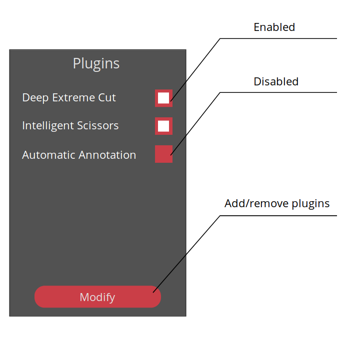
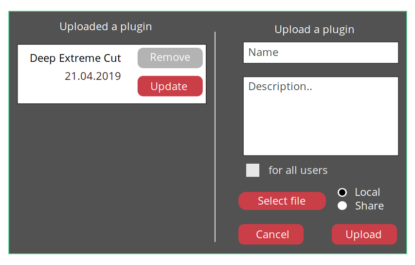

# Client plugin proposals

## User view

### Plugin list scroll window


### Modify plugins dialog window


## Techincal

## JS Plugin structure
Plugin is a JavaScript file. Something like this:

```
(() => {
    const plugin = {
        start() {
            // what plugin should to do on its start [optional, default is null]
            // in particular here we can change UI

            // There can be two ways of UI modification (read below)
        },

        stop() {
            // what plugin should to do on its stop [optional, defaul is null]
            // in particular here we can change UI
        },

        enabled: false,     // default false if both start() and stop() are defined else true

        // here you can expand any API methods
        cvat: {
            server: {
                about: {
                    // Plugin adds some actions after executing the cvat.server.about()
                    // For example it adds a field with installed plugins to a result
                    // An argument "self" is a plugin itself
                    // An argument "result" is a return value of cvat.server.about()
                    // All next arguments are arguments of a wrapped function
                    // (in this case the wrapped function doesn't have any arguments)
                    async leave(self, result) {
                        result.plugins = await self.internal.getPlugins();
                        // Note that a method leave must return "result" (changed or not)
                        // Otherwise API won't work as expected
                        return result;
                    },
                },
            },
            // In this example plugin also wraps a class method
            classes: {
                Job: {
                    prototype: {
                        annotations: {
                            put: {
                                // The first argument "self" is a plugin, like in a case above
                                // The second argument is an argument of the
                                // cvat.Job.annotations.put()
                                // It contains an array of objects to put
                                // In this sample we round objects coordinates and save them
                                enter(self, objects) {
                                    for (const obj of objects) {
                                        if (obj.type != 'tag') {
                                            const points = obj.position.map((point) => {
                                            const roundPoint = {
                                                x: Math.round(point.x),
                                                y: Math.round(point.y),
                                            };
                                            return roundPoint;
                                            });
                                        }
                                    }
                                },
                            },
                        },
                    },
                },
            },
        },
    };

    window.cvat.plugins.register(plugin);
})();
```

## REST API
### Getting of plugins list

```
URL: /api/v1/plugins
Method: GET
Response body:
{
    "count": 0,
    "next": null,
    "previous": null,
    "results": [{
        id: 0,
        name: 'Deep Extreme Cut',
        description: 'Plugin allows you get semi-automatic segmentation ...',
        predefined: true,
        file: 'url of a JS file which will be uploaded dinamically',
    }]
}
```

### Creating of a new plugin
```
URL: /api/v1/plugins
Method: POST
Request body:
{
    name: 'Deep Extreme Cut',
    description: 'Plugin allows you get semi-automatic segmentation ...',
    global: false,
    file: JS File or share string,
}
```

### Modification of a plugin
```
URL: /api/v1/plugins/<id>
Method: PATCH
Request body:
{
    name: 'Deep Extreme Cut',
    description: 'Plugin allows you get semi-automatic segmentation ...',
    global: false,
    file: JS File or share string,
}
```

### Removing of a plugin
```
URL: /api/v1/plugins/<id>
Method: DELETE
```

### There are two kinds of plugins:
- Predefined plugins (installed within docker)
- User plugins (installed by a user)


### There are two ways of UI modifications:
- CSS-based modification (in my opinion we should choose it)
    - A JS file changes UI by using CSS selectors.
    - Great opportunities for change UI
    - We have to support a naming system of HTML elements (classes, identificators)

- API-based modification
    - Each UI should implement an API to its modification. For example:
      - addButtonToTaskBlock(text, handler)
      - addTextToMenu(text)
      - etc
    - We have to support this API and expand it


### How do run initialization of plugins?

```
// Method init gets all plugins from the server
// After init if a plugin is enabled by default
// Its start() method is executed

window.cvat.plugins.init();
```

### How do get a list of plugins?
```
window.cvat.plugins.list();
// Method returns a list of objects:
{
    name: string,
    description: string,
    enabled: true/false,
    onstart(),
    onstop(),
}
```
